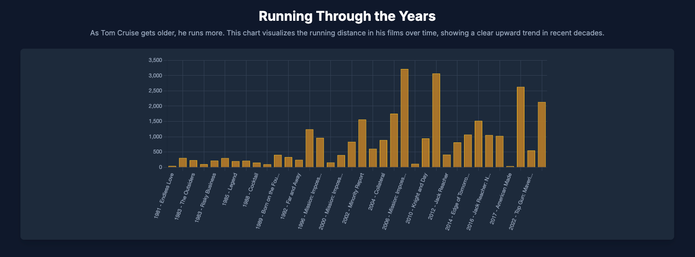

# The Cinematic Marathon: A Tom Cruise Running Analysis Hub

This project is a pioneering venture into "cinematic sabermetrics," creating the world's most comprehensive and authoritative dataset on Tom Cruise's on-screen running, presented through innovative visualizations and interactive tools.

---

## Live Demo & Screenshot

**[➡️ Visit the Live Site Here](https://tomcruiserunningtime.com)** 🚀

---

## Overview

Over a career spanning more than four decades, Tom Cruise has sprinted an estimated 36,032 feet on screen—approximately 6.82 miles. This recurring action has become a subject of cultural fascination, spawning video supercuts and a persistent meme culture.

`tomcruiserunningtime.com` is not a conventional fan website, but an analytical platform that applies the rigorous, data-driven principles of sports statistics to the performance traits of a film actor. By treating his filmography as a "season," each movie as a "game," and each sprint as a measurable "play," the website transforms a cultural inside joke into a sophisticated analytical tool. Our primary objective is to establish this site as the definitive, comprehensive, and encyclopedic source of data on this subject.

---

## 🛠️ Tech Stack

This project is built with a modern, scalable architecture designed for a rich, interactive user experience.

- **Frontend**: React, Chart.js, Tailwind CSS
- **Backend**: Node.js with a GraphQL API
- **Databases**:
  - **PostgreSQL**: For structured data like user authentication and filmography details.
  - **MongoDB**: For flexible data, such as user-customizable dashboards.
- **Infrastructure & DevOps**:
  - **Terraform**: For Infrastructure as Code (IaC) to manage cloud resources.
- **Containerization**: Docker and Docker Compose
- **Cloud Services**: Deployed on a major cloud provider (e.g., AWS, Google Cloud, Azure).

---

## ✨ Features

The platform is designed to be the ultimate resource for fans, journalists, and researchers interested in this unique cinematic phenomenon.

### Core Features

- **Film-o-Graphy Index**: A central, sortable, and filterable master list of Tom Cruise's entire filmography.
- **Film Detail Page with "Runner Card"**: Each film has a dedicated page featuring a "Runner Card" that displays key running statistics (distance, time, instances, density) with color-coded percentile rankings against his career averages.
- **The "Run Query Tool"**: A powerful search interface, modeled on Baseball Savant's Statcast Search, allowing users to filter the entire database of 295+ individual running moments by film attributes, running metrics, and contextual details.
- **Interactive Data Visualizations**: A dedicated "Savant Section" with charts telling the macro-level story of Cruise's running career, including a career timeline and a distance vs. quality scatter plot.

### Analytical Features

- **The "Cruise Performance Index" (CPI)**: A proprietary, weighted metric that provides a nuanced score for each film, measuring its effectiveness as a quintessential "Tom Cruise Running Movie." The formula is:
  `CPI = (Running Distance in Feet) / (Runtime in Minutes) * (Tomatometer Score / 100)`.
- **Qualitative Analysis**: The "Academy" section provides a qualitative and biomechanical breakdown of his running form, its evolution, and its role in cinematic storytelling.

---

## Special Shoutout

### Data Compilation & Analysis

- **Source**: [GitHub: gshick/Run_Tom_Run](https://github.com/gshick/Run_Tom_Run)
- **Data**: CSV compilation of Rotten Tomatoes running distance data
- **Format**: 16 films with running distances and box office revenue
- **Analysis**: R-based statistical analysis
- **Author**: gshick
- **License**: GPL-3.0

---

## 📜 License

This project is licensed under the MIT License. See the `LICENSE` file for details.
